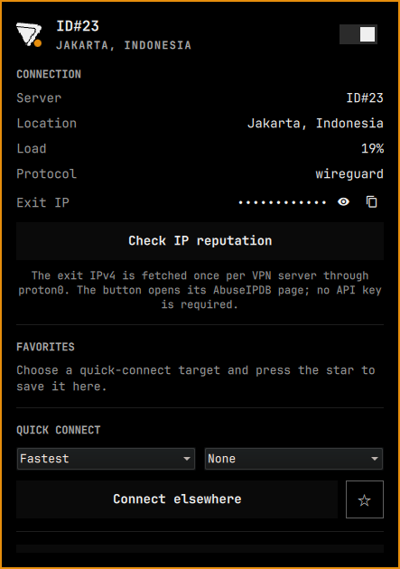
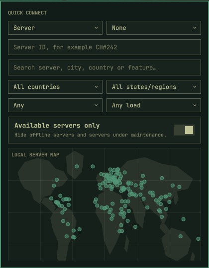
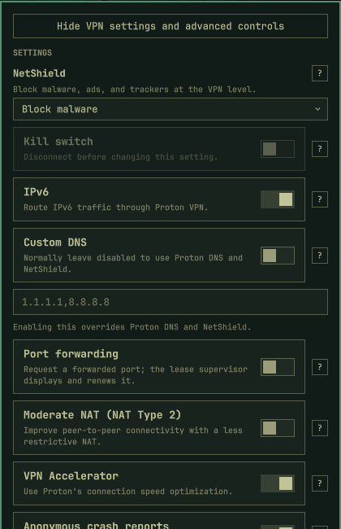

# Proton VPN Control Center for Omarchy

[](https://github.com/denizkin28/omarchy-proton-vpn-control-center/actions/workflows/ci.yml)

A security-reviewed Omarchy bar widget for the official Proton VPN Linux CLI.

This plugin is maintained by [@denizkin28](https://github.com/denizkin28) and is
derived from Bram Vera's MIT-licensed Proton VPN Control Center. It keeps the
original copyright and attribution while using the `denizkin.protonvpn` identity.

Connect, disconnect, choose locations, manage VPN settings, save favorite targets, and inspect the active exit IP without leaving the Omarchy bar.

> [!IMPORTANT]
> This is an unofficial community plugin. It is not affiliated with, sponsored by, or endorsed by Proton AG or Omarchy.

## Preview



## Screenshots

| Connection | Server map | VPN settings |
| --- | --- | --- |
|  |  |  |

## Install

```bash
omarchy plugin add https://github.com/denizkin28/omarchy-proton-vpn-control-center.git --enable
```

The widget appears in the right section of the bar by default.

## First run

The plugin checks whether the official `protonvpn` CLI is available.

If it is missing, open the panel and select **Install Proton VPN CLI**. Omarchy opens a floating terminal and installs the Arch package with:

```bash
omarchy install app 'Proton VPN CLI' proton-vpn-cli
```

The terminal owns the `sudo` prompt. The plugin never reads or stores your system password.

After installation, enter your Proton username in the panel and select **Sign in with Proton**. Authentication runs interactively in a terminal:

```bash
protonvpn signin USERNAME
```

The plugin never handles your Proton password. A small HUP-resistant terminal wrapper keeps Proton's official interactive prompt open, displays failures until you dismiss them, and lets the panel detect success or return promptly to **Needs sign-in** after a rejected password.

> [!WARNING]
> The official Proton VPN CLI cannot run alongside the Proton VPN GUI. Headless use is also unsupported. Read [Proton's official Linux CLI guide](https://protonvpn.com/support/linux-cli) before replacing an existing GUI installation.

## Dependencies

Required:

- Omarchy with shell-plugin support
- The official Proton VPN Linux CLI (`protonvpn`); the guided installer uses Omarchy's `proton-vpn-cli` package
- NetworkManager and a supported secret store, as documented by [Proton's Linux CLI installation guide](https://protonvpn.com/support/linux-cli)

Runtime helpers:

- `curl` fetches the exit IPv4 through the Proton interface
- `resolvectl` detects whether Proton's internal DNS is active
- `nmcli` applies the optional, user-approved DNS-over-TLS exception to the active `proton0` device
- `wl-copy` copies a revealed exit IP to the Wayland clipboard
- `omarchy launch browser` opens the AbuseIPDB check page

External network services:

- [ipify](https://www.ipify.org/) returns the exit IPv4 after a new VPN server is detected
- [AbuseIPDB](https://www.abuseipdb.com/faq) displays an IP reputation page only when **Check IP reputation** is selected; this plugin does not use its API

## Features

### Connection

- Live status, server, location, load, protocol, and public exit IPv4
- Connect or disconnect from the bar icon or panel switch
- Fastest-server and random-server quick connect
- Searchable countries loaded directly from the signed-in CLI
- Cascading, searchable city lists for the selected country
- Manual connection to a known server ID, such as `CH#242`
- Full searchable server browser sourced read-only from Proton's local cache
- Interactive local server map with continent context, Ctrl+scroll zoom, and drag panning, using normalized cached coordinates without a map service or tracking
- Server load, availability, tier, entry/exit country, and feature filters
- P2P, Secure Core, and Tor server filters
- Favorite quick-connect targets that persist across shell restarts

### Privacy and diagnostics

- Exit IP fetched once per detected VPN server through `proton0`
- Exit IP masked by default with compact reveal, hide, and copy controls
- AbuseIPDB reputation page opened on demand without an API key
- Exit-IP requests fail closed if `proton0` disappears instead of falling back to the normal route
- Proton-only DNS-over-TLS compatibility for systems that enforce strict global DoT
- Custom DNS remains optional so Proton DNS and NetShield work normally

### VPN configuration

- NetShield: off, malware-only, or malware, ads, and trackers
- Kill switch
- IPv6
- Custom DNS with multiple comma-separated servers
- Port forwarding
- Moderate NAT (NAT Type 2)
- VPN Accelerator
- Anonymous crash reports
- Paid-plan and connected-state restrictions surfaced directly from the CLI

### Omarchy integration

- Theme-native Proton VPN icon, typography, colors, switches, and buttons
- Automatic CLI detection with a guided Omarchy package installer
- Guided terminal sign-in without handling the Proton password
- Configurable CLI path, default country, and refresh interval
- Persistent favorites and custom DNS input through Omarchy widget settings
- Argument-array process execution without interpolating user values into a shell command

### Profiles and smart connections

- Save up to 12 named profiles containing the selected target, feature, and current CLI settings
- Apply profiles through validated sequential official CLI commands
- Search the full cache and smart-connect to the lowest-load available matching server
- Keep a local history of the 20 most recently used unique servers
- Browse and filter servers by state or region when Proton provides that metadata

### Health and automation

- Distinguish connected, connecting, degraded, unprotected, offline, and login-required states
- Verify the `proton0` interface, default VPN route, Proton DNS, and tunnel traffic counters
- Optional auto-connect on untrusted networks with a two-minute retry cooldown
- Mark NetworkManager connections as trusted without changing NetworkManager itself
- Choose Fastest or a saved profile as the untrusted-network policy
- Optional recovery after an unexpected drop: retry the last server, then Fastest
- One shared service keeps polling, automation, and connection state synchronized across monitors
- Shared manual-disconnect markers prevent recovery from undoing deliberate or transactional disconnects; recovery remains suppressed for about 45 seconds after such an operation
- Optional desktop notifications for recovery and forwarded-port changes

Trust is matched by NetworkManager connection name, not by cryptographic network
identity. A different access point reusing a trusted SSID/profile name may also be
treated as trusted; use this convenience feature only for names you control.

### Port forwarding and split tunnelling

- Start or stop the existing `proton-port-forward.service` lease supervisor
- Display the current forwarded port, renewal status, and qBittorrent delivery state
- Read and update Proton's official split-tunnelling settings and D-Bus backend
- Support include/exclude mode with executable paths and IP ranges
- Search installed desktop applications and add them without typing executable paths
- Require disconnection before split-tunnelling changes

### Protocol and advanced kill switch

- Detect protocols validated by the installed Proton registry; currently WireGuard and OpenVPN UDP/TCP
- Apply disconnected-only changes transactionally, reconnect the current server, and roll back on failure
- Expose Proton's persistent advanced kill switch through its official NetworkManager backend
- Refuse unsafe advanced-kill-switch activation when no known reconnect server is available
- Reject protocol, kill-switch, and split-tunnelling combinations that Proton marks incompatible
- Keep unvalidated Proton Protocols and Stealth hidden rather than offering nonfunctional controls

## Controls

- Left click: open or close the panel
- Right click: connect to the fastest server, or confirm before disconnecting
- Middle click: refresh status
- `T`: connect, or confirm before disconnecting, while the panel is focused
- `R`: refresh while the panel is focused

## Locations and servers

Countries and cities come directly from the official CLI. Select a country first, then search its available cities.

The versioned `protonvpn-data-helper` reads Proton API Core's local server cache
and returns normalized schema-versioned JSON to the QML plugin. It never returns
Proton Python objects or modifies the cache. The browser searches the complete
cache while returning at most 100 sorted results per query to keep the shell
responsive.

The map aggregates matching servers by exit country and plots Proton's cached
latitude/longitude values locally. Selecting a marker applies the country filter;
it never connects directly or contacts a mapping provider. Use **Ctrl+scroll** to
zoom around the pointer, drag to pan, and double-click to reset the view.

Selecting an individual server always invokes only `protonvpn connect SERVER_ID`.
The helper never connects, disconnects, authenticates, refreshes the server list,
or changes VPN settings. If Proton changes its internal Python API or cache format,
the enhanced browser disables itself and manual server-ID entry remains available.

City connections continue to ask Proton VPN to choose the fastest eligible server
in that city.

## VPN settings

Open **VPN settings** to manage every configuration option exposed by the current CLI:

- NetShield
- Kill switch
- IPv6
- Custom DNS
- Port forwarding
- Moderate NAT (NAT Type 2)
- VPN Accelerator
- Anonymous crash reports

Settings are read from `protonvpn config list` and changed through argument-array calls equivalent to:

```bash
protonvpn config set SETTING VALUE
```

The plugin never interpolates setting values into a shell command.

### Custom DNS

Custom DNS is optional and normally should remain disabled so Proton DNS and NetShield can work. Enabling it overrides Proton's DNS service.

On systems that enforce DNS-over-TLS globally, Proton's internal DNS server does not accept DoT. After a connection appears, the plugin performs a read-only check of `proton0`. If an exception is needed, the panel explains why and waits for you to select **Allow Proton DNS**. That explicit action disables DoT for the active Proton device only; global DoT settings, persistent NetworkManager profiles, and third-party DNS links are not changed.

## Configuration changes and consent

The plugin does not overwrite user configuration automatically. Status polling, country and city discovery, configuration reads, and DNS compatibility detection are read-only.

State changes happen only after an explicit control is selected:

- Connect, disconnect, and VPN setting controls invoke the corresponding `protonvpn` command.
- The favorite star and custom-DNS enable control save only this widget's values in Omarchy's shell entry.
- **Install Proton VPN CLI** and **Sign in with Proton** open an interactive terminal.
- **Allow Proton DNS** applies `nmcli device modify proton0 connection.dns-over-tls 0` to the active Proton device. It is never run by detection alone.
- **Check IP reputation** opens the public AbuseIPDB page for the displayed exit IP.
- Network-aware auto-connect remains disabled until explicitly enabled.
- Unexpected-drop recovery and VPN notifications remain disabled until explicitly enabled.
- Trusted-network entries, profiles, and server history stay in the Omarchy plugin settings.
- Port lease controls only start or stop the existing user service; they do not enable it at boot.
- Split-tunnelling changes require an explicit button press and are rejected while connected.

## Advanced helpers

`protonvpn-data-helper` is the read-only server-cache bridge.
`protonvpn-system-helper` provides versioned JSON for health, active-network,
port-forwarding status, profiles, and guarded split-tunnelling operations.

The port-forwarding lease follows Proton's documented NAT-PMP procedure: TCP
and UDP mappings use gateway `10.2.0.1`, have a 60-second lease, and renew every
45 seconds. It requires a paid plan, an eligible P2P server, and port forwarding
enabled in the Proton CLI configuration.

The plugin does not edit files under `/usr/share/omarchy` or replace unrelated user configuration.

### Setting limitations

- Proton requires disconnection for protocol, kill-switch, and split-tunnelling changes. The plugin performs that transition automatically, reconnects the current server, and rolls back if either the change or reconnection fails.
- Paid-plan settings remain unavailable when the CLI reports `Upgrade to enable`.
- Enabling port forwarding requests a forwarded port, but a separate helper must maintain and retrieve the lease. See [Proton's Linux CLI documentation](https://protonvpn.com/support/use-linux-cli) for the current example.
- Proton VPN CLI 1.0.1 does not expose Stealth or Smart Protocol through its command or validated backend registry. The plugin hides them instead of writing undocumented settings.
- The official CLI currently documents split tunnelling as unavailable. This plugin enables its controls only when Proton's separately installed official D-Bus backend is actually detected.
- Password and two-factor prompts remain inside Proton's official interactive CLI. Embedding them in QML would require the plugin to handle credentials and is intentionally not implemented.

## Build a distributable archive

Create a deterministic archive and SHA-256 checksum without including Git data,
local caches, diagnostics, or credentials:

```bash
./tools/package.sh
```

Artifacts are written to `dist/`. See [DISTRIBUTION.md](DISTRIBUTION.md) for the
review, tagging, and installation workflow. Publishing or pushing remains a
separate explicit maintainer action.

## Exit-IP reputation

When a new VPN connection or server is detected, the plugin makes one HTTPS request to [ipify](https://www.ipify.org/) through `proton0` and displays the public exit IPv4 in the connection details. It is masked by default; use the small reveal or copy controls beside it. The plugin does not repeat the lookup during normal status polling.

Select **Check IP reputation** to open `https://www.abuseipdb.com/check/<exit-ip>` in your default browser.

The reputation action does not use an AbuseIPDB API key. AbuseIPDB describes its service in its [FAQ](https://www.abuseipdb.com/faq). If `proton0` disappears, exit-IP discovery fails instead of falling back to your normal connection.

## Configure the bar widget

Omarchy's widget settings expose:

- CLI executable name or absolute path
- Default country code
- Status refresh interval

You can move the widget with Omarchy's normal bar command:

```bash
omarchy bar move denizkin.protonvpn --section right
```

## Update

This plugin is independently maintained. Review changes from the
[original project](https://github.com/bramvera/omarchy-proton-vpn) before merging
them; do not replace this installation with an unreviewed marketplace update.

## Remove

```bash
omarchy plugin remove denizkin.protonvpn
```

Removing the plugin does not uninstall the Proton VPN CLI or alter your Proton account.

VPN settings you explicitly changed through the panel remain Proton VPN CLI settings after removal. Revert them in the panel before removal or later with `protonvpn config set`. The optional DNS exception targets only the active `proton0` device.

## Development

Clone the repository and validate it against the installed Omarchy shell:

```bash
git clone https://github.com/denizkin28/omarchy-proton-vpn-control-center.git denizkin.protonvpn
cd denizkin.protonvpn

omarchy plugin validate .
bash -n protonvpn-signin-terminal tools/package.sh tests/fake-protonvpn
node --test tests/*.test.js
python tests/data-helper.test.py -v
python tests/system-helper.test.py -v
python tests/lifecycle.test.py -v
```

For local development, link the checkout into Omarchy's user-owned plugin directory:

```bash
ln -s "$PWD" "$HOME/.config/omarchy/plugins/denizkin.protonvpn"
omarchy restart shell
```

Do not start a second Quickshell process. Omarchy plugins share the existing long-running shell process.

`omarchy plugin validate .` is the authoritative QML/plugin check. Standalone
`qmllint` cannot fully resolve Omarchy's runtime-provided `qs.*` namespaces and
typed IPC syntax, so it may emit false-positive import or parser warnings.

## Continuous integration

GitHub Actions runs shell syntax checks, the portable JavaScript and Python test
suites, lifecycle checks, and a release-archive build on every push and pull
request to `main`. Tests that require an installed Omarchy shell, Proton backend,
NetworkManager, or desktop integration are skipped only when those host
dependencies are unavailable; the complete suite runs without skips on a fully
configured Omarchy system.

The workflow grants only read access to repository contents and pins official
GitHub Actions to reviewed commit SHAs. Dependabot checks those action pins
weekly and proposes updates through pull requests.

## IPC

The widget exposes these methods on `denizkin.protonvpn`:

`open`, `close`, `show`, `hide`, `toggle`, `openSettings`, `openServerMap`, `refresh`, `refreshLocations`, `loadCities`, `locationStatus`, `refreshServers`, `serverStatus`, `refreshConfig`, `configStatus`, `advancedStatus`, `checkExitIp`, `exitIpStatus`, `up`, `disconnect`, and `status`.

## License

[MIT](LICENSE)

## Credits and trademarks

- [Proton VPN](https://protonvpn.com/) and its official Linux CLI are products of Proton AG. The Proton VPN name and mark belong to Proton AG. The connected gradient logomark is sourced directly from the [Proton media kit](https://proton.me/media/kit); the disconnected monochrome silhouette is adapted from the [Streamline Simple Icons Proton VPN mark](https://streamlinehq.com/icons/simple-icons). This project is unofficial and does not imply endorsement.
- [AbuseIPDB](https://www.abuseipdb.com/faq) provides the public reputation page opened by the optional check. No AbuseIPDB logo, code, API key, or API response is bundled by this plugin.
- [ipify](https://www.ipify.org/) provides the public IPv4 lookup endpoint used through `proton0`.
- The preview screenshots were captured from this plugin. Third-party names and marks shown in them remain the property of their respective owners.

Marketplace approval lists the plugin; it is not a security review. Review the source and the documented commands before installing it.
